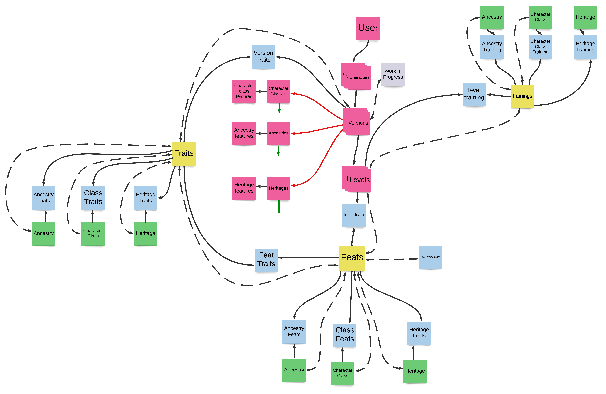

# Pathmaster Version Controled Character Builder
## -Backend

## Purpose
Most character builders for pathfinder 2e only allow for a single version of a character and only allow for a single level of each version.  A lot of time for players is wasted recreating sheets for GMs to meet the level and module requirements for characters.  This project aims to reduce the work load of potential players while validating builds for GMs.

## Future Goals:

Players will be able to create a character object which will house multiple versions.  Each version will contain a complete layout of levels 1-20, which do not have to be completed.  Players may attempt to submit their character as a part of a game application.  If the application is set up appropriately, it will notify the player if they have not completed their sheet up to the correct level, if any of the existing feats or banned, or if the player has not met the requirements for the game, such as an Adventure Path background.

In the event that a player must make edits before submitting, the player will be given the ability to create a new version that complies with the requirements.  This version will be saved and may be reused during another submission.  Each submission will be validated in order of preference until a valid submission is accepted.

## Current State

To run the Backend, run "rake server",  which utlizes:
[http://localhost:9292](http://localhost:9292).

To run the Frontend, run "npm start" which utilizes:
[http://localhost:3000](http://localhost:3000).

Frontend capacity only allows for the user to create a new character with seed data.  These characters will create a host of additional hashes during creation which are required during destruction.  Once created, a new fetch for all of a user's characters will be sent and read by the front-end.

Users may also delete characters, which will destroy any dependent hashes on the server and then the front-end will refresh with a fresh character list.

Currently, each of these actions are done as two seperate fetches, which needs to be reduced down to one as there is a delay.

Ansyncronus shallow copies could be used to enhance performance, but may lead to issues in destruction due to "has_one" associations.

## Domain Model
The below model illustrate the relations between each table:

### Tables:
- Pink tables represent classes with user choices
- Yellow tables represent static component libraries
- Blue tables represent 1:1 join tables

#### **NOTE**

- Green tables represent Pink tables of the same name and are used only for illustration purposes.

### Relationships
- Black Solid lines represent 1:Many relationships
- Red Solid lines represent has_one relationships
- Black Dotted lines represent a has_through relationship

#### **NOTE**

- All Pink tables are Dependent: :Destroy to the level it belongs to.
- Green lines represent that a Green table has been created for illustration purposes.

